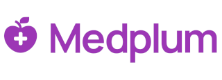
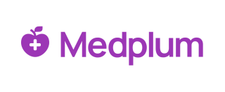

# Google Workspces

## Official Docs

https://support.google.com/a/answer/96474?hl=en&src=supportwidget0&authuser=0

- The logo on your services pages is displayed at exactly 320 x 132 pixels; therefore, the recommended image size that you upload is exactly 320 x 132 pixels.
- If you upload a smaller or larger image, the image is resized to exactly 320 x 132 pixels. If the aspect ratio does not match, then the image will be distorted. For example, a 132 x 132 pixel image expands to 320 x 132 pixels, causing distortion.

## The Challenge

The docs say 320 x 132 (2.4:1)

The actual element in GMail is 72 x 26 (2.77:1)

Target 320 x 116 (2.77:1)

## Gemini Analysis

This is a known and common issue. The behavior you're seeing in Gmail is not an error on your part, but rather a result of how Google handles and displays the custom logo across different applications.

Here's a breakdown of the situation:

### The "One Logo, Many Displays" Problem

- **Google's Requirement:** Google Workspace requires a single logo file to be uploaded by the administrator. The recommended dimensions are **320 x 132 pixels** with a maximum file size of **30 KB** and in either PNG or GIF format.
- **The Mismatch:** While this logo is intended for all Google Workspace services, different applications (like Gmail, Calendar, Drive, and Docs) have different user interfaces and different spaces to display the logo.
- **The Distortion:** When the logo is displayed, Google's systems resize the image to fit the specific space available in that application. If the aspect ratio of the original logo (320x132, which is roughly 2.42:1) doesn't perfectly match the display area's aspect ratio in a specific app, the image can be stretched or distorted to fit. This is most noticeable in Gmail, where the logo is often displayed in a much smaller, sometimes more square, area.

### Why It's a "Known Issue"

This is a frequently discussed topic in Google Workspace forums and communities. Administrators often report their logo looking perfect in some apps (like Google Docs or Sheets) but looking stretched or blurry in Gmail.

### What You Can Do About It

Unfortunately, there's no way to upload different logos for different Google Workspace services. However, you can try to optimize your logo to look as good as possible across all of them:

- **Design for the 320x132 Canvas:** When creating your logo, keep in mind that it will be scaled to a rectangle. Design the logo with this specific aspect ratio in mind.
- **Keep it Simple:** A logo with a lot of detail or a square-based design may be more susceptible to looking bad when it's resized. A simpler, more horizontal logo may fare better.
- **Test and Adjust:** The best approach is often a process of trial and error. Upload your logo and check how it looks in Gmail, Calendar, Drive, and other services. If it's distorted, you may need to go back to your design and adjust the logo's internal composition to better fit the rectangular and constrained display areas.

